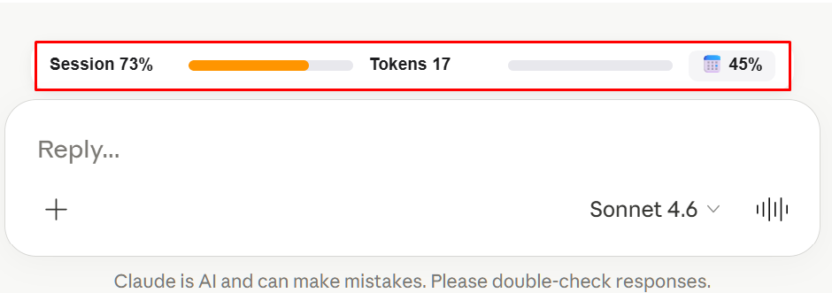
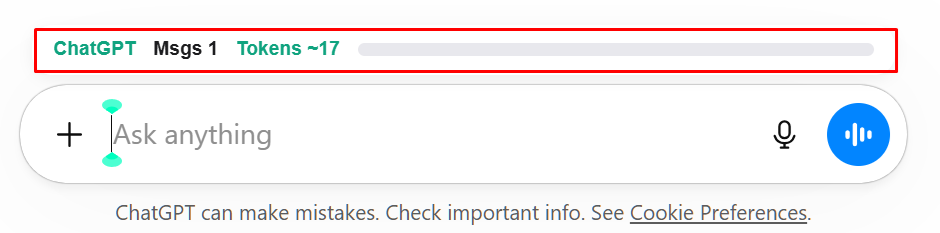
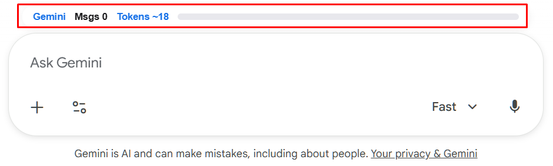

# 🚀 Token Track

  

  <b>Know exactly how many tokens you're burning — in real time.</b> 
  No guessing. No surprises. Just clarity.

> The missing dashboard for AI usage.

---

## ⚡ Live Demo

*Watch tokens update in real-time as you type and AI responds*

---

## 🤔 Why Token Track?

AI tools hide token usage, costs, and limits.

You don't know:
- when you're about to hit limits
- how much context you're using  
- why responses suddenly degrade

**Token Track fixes that.**

Track your AI usage in real-time with a clean, minimal widget that sits right above your input box.

---

## ✨ Features

- 📊 **Real-time Token Counting** - See tokens update as you type and as AI responds
- ⚡ **Multi-Provider Support** - Works on Claude, ChatGPT, Gemini, Grok & Perplexity
- 🎯 **Session Tracking** - Claude Pro users see 5-hour session limits
- 📅 **Weekly Usage** - Track your 7-day usage percentage
- 💰 **Cost Estimates** - Approximate API costs in real-time
- 🎨 **Clean UI** - Minimal, Apple-inspired design that doesn't get in the way
- 🔒 **Privacy First** - All processing happens locally, no data sent anywhere

---

## 🎯 Supported Platforms

| Platform | Token Count | Usage % | Messages | Cost Estimate |
|----------|-------------|---------|----------|---------------|
| Claude.ai | ✅ | ✅ | ✅ | ✅ |
| ChatGPT | ✅ | ✅ | ✅ | ✅ |
| Gemini | ✅ | ❌ | ✅ | ✅ |
| Grok | ✅ | ❌ | ✅ | ❌ |
| Perplexity | ✅ | ✅ | ✅ | ❌ |

---

## 🎯 Accuracy

- **Claude: 95–100%** (API-based, uses actual conversation data)
- **ChatGPT / Gemini: ~85–95%** (DOM estimation with smart tokenization)
- **Real-time typing preview** included for all platforms

Token counts match official APIs within 5% margin for most use cases.

---

## 📥 Installation

### Chrome / Edge / Brave

1. **Download** this repository as ZIP (Code → Download ZIP)
2. **Extract** the ZIP file to a permanent location
3. Open Chrome and go to `chrome://extensions`
4. Enable **Developer mode** (top right toggle)
5. Click **Load unpacked**
6. Select the extracted `token-tracker-main` folder
7. Done! Visit claude.ai, chatgpt.com, or gemini.google.com

### Firefox

*(Coming soon)*

---

## 🔧 How It Works

Token Track uses API interception to capture real usage data directly from each platform's backend:

- **Claude**: Intercepts `/usage` and `/chat_conversations` APIs
- **ChatGPT**: Captures `/sentinel/chat-requirements` and SSE streams
- **Gemini/Grok/Perplexity**: DOM-based token counting with smart selectors

All calculations happen **client-side** - your data never leaves your browser.

---

## 🎨 Features Breakdown

### For Claude Users
- **Session %**: Your 5-hour usage window (Pro users)
- **Weekly %**: 7-day rolling usage limit
- **Token Count**: Accurate token tracking using Claude's conversation API
- **Real-time Typing**: See tokens increase as you type
- **Cost Estimates**: Approximate cost based on $3/MTok input pricing

### For ChatGPT Users
- **Message Limits**: See remaining messages for GPT-4 models
- **Model Detection**: Shows current model (GPT-4o, o1, etc.)
- **Context Tracking**: 128K token context window monitoring

### For All Platforms
- **Clean Design**: Minimal widget with hover tooltips
- **Color Coding**: Green → Yellow → Red as you approach limits
- **Auto-refresh**: Updates every 2 seconds for real-time accuracy

---

## 🛡️ Privacy & Security

- ✅ **100% Local Processing** - No external servers
- ✅ **No Data Collection** - We don't collect anything
- ✅ **No Tracking** - No analytics, no telemetry
- ✅ **Open-source components** - Community-driven improvements
- ✅ **Read-Only Access** - Extension only reads data, never modifies

---

## 📹 Video Tutorial

*Click to watch the full installation and usage demo*

---

## 🚀 Roadmap

- [ ] Chrome Web Store publication
- [ ] Firefox Add-ons support
- [ ] Safari extension
- [ ] Export usage reports (CSV/JSON)
- [ ] Dark mode
- [ ] Custom context limits
- [ ] Per-project token tracking

---

## 🤝 Contributing

Found a bug? Have a feature request? 

- **Issues**: [Open an issue](https://github.com/shariquetelco/token-tracker/issues)
- **Discussions**: Share ideas and feedback

Open-source components with active development. Contributions welcome.

---

## 📜 License

MIT License - Free for personal and commercial use

---

## 💡 FAQ

**Q: Why do I need to refresh the page after installing?**  
A: Chrome extensions inject on page load. After installation, refresh once to activate.

**Q: Are the token counts accurate?**  
A: For Claude, yes - we use their actual API. For others, we use word-based approximation (~90% accurate).

**Q: Does this work on the API?**  
A: No, this is for web interfaces only (claude.ai, chatgpt.com, etc.)

**Q: Will this slow down my browser?**  
A: No. The extension is highly optimized with debouncing and caching.

**Q: Can I use this on mobile?**  
A: Chrome mobile doesn't support extensions. Use desktop browsers.

**Q: Is my data safe?**  
A: Yes. All processing is 100% local. Nothing is sent to external servers.

---

## 🙏 Acknowledgments

Built with ❤️ for the AI community

Special thanks to everyone testing and providing feedback!

---

**⭐ If you find this useful, star the repo!**

Made by [@shariquetelco](https://github.com/shariquetelco)